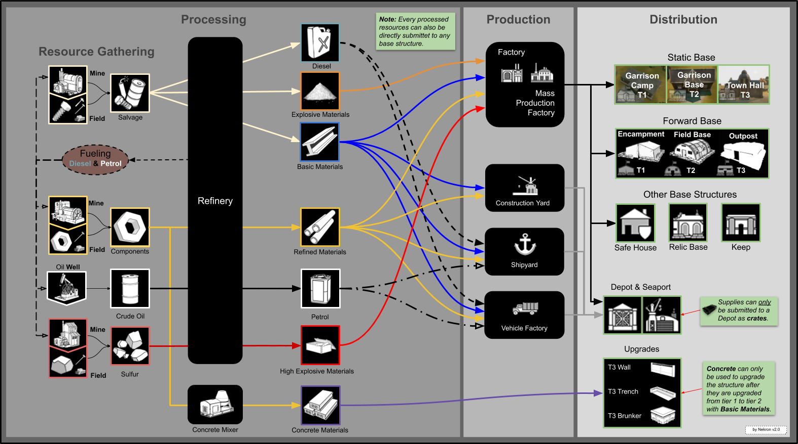
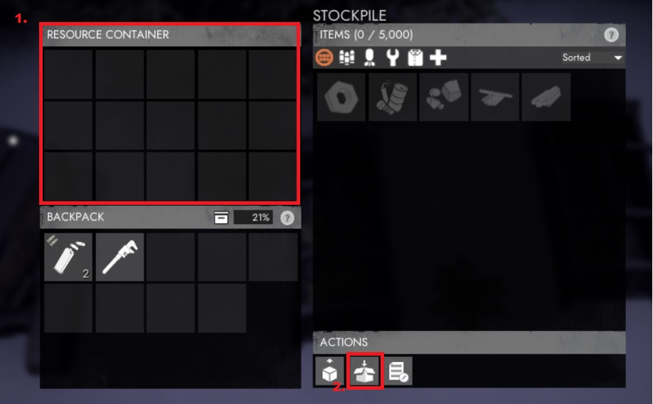
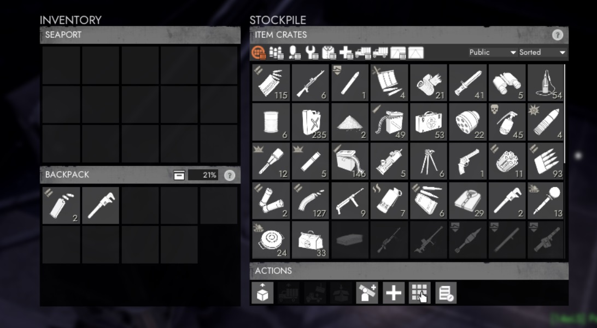
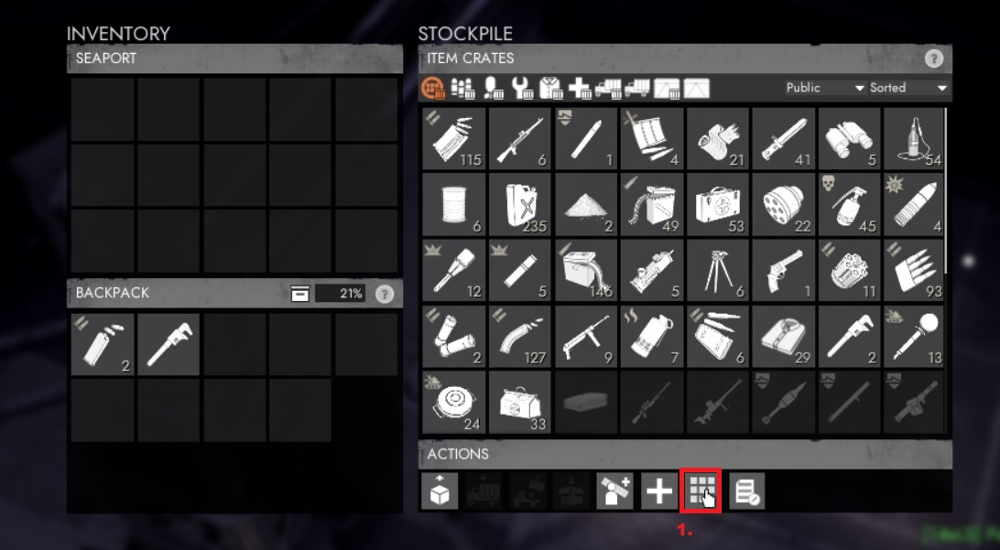
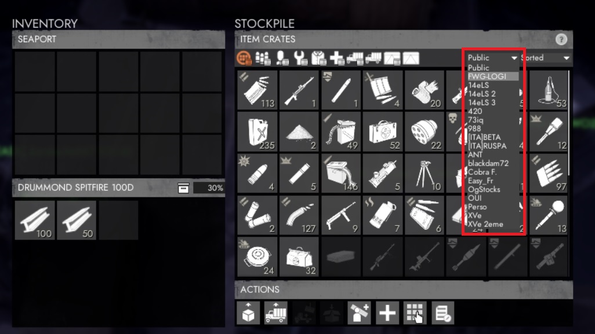
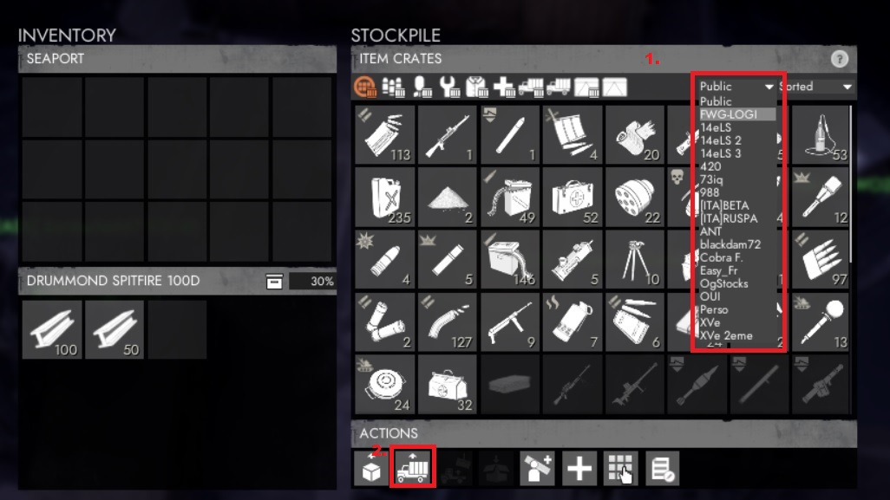
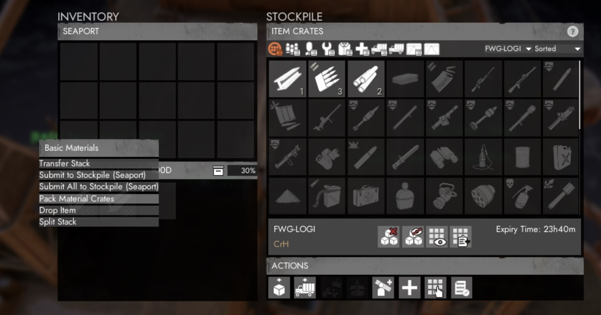

# LOGI 101

## INTRODUCTION

Some inspiring quotes about logistics and its vital importance.

> *"The line between disorder and order lies in logistics…"* - Sun Tzu

> *"Gentlemen, the officer who doesn't know his communications and supply as well as his tactics is totally useless."* - Gen. George S. Patton, USA

> *"Forget logistics, you lose."* - Lt. Gen. Fredrick Franks, USA, 7th Corps Commander, Desert Storm

> *"Leaders win through logistics. Vision, sure. Strategy, yes. But when you go to war, you need to have both toilet paper and bullets at the right place at the right time. In other words, you must win through superior logistics."* - Tom Peters - Rule #3: Leadership Is Confusing As Hell, Fast Company, March 2001

Lets dig in !

#### Definition :

In the FWG regiment we considere that logistics covers :
- production of items
- Item delievery
- Base building / base maintenance

This document will refere to :
- a crate : is a container of X number of a specific item. A crate takes 1 slot in an inventory
- item when the 'object' is not in a 'crate'

#### Job orders :

As a FWG logi-member, you will find your asignment in discord : #logi-orders
Their will be pinned messages that describe what as to be :
- produce
- deliever
- where and when

## RESOURCES

they come in several type : **Salvage**, **Components**, **Crude Oil** & **Sulfur**

They are refined in the Rafinery building as describe in the below picture

| Raw			| Refined           				| Ratio  | Time per stack (min)
| ------------- |:-------------:					| -----:| -----:|
| Salvage		| Basic Material (*B-mat*)			| 2:1	| 0:06
| Salvage		| Diesel							| 10:1	| 0:12
| Salvage		|  Explosive Materials (*E-mat*)	| 10:1	| 5:33
| Components	| Refined Materials (*R-mat*) 		| 20:1	| 0:40
| Crude Oil		| Petrol 							| 3:1	| 6:00
| Sulfur		| Heavy Explosive Material 			| 20:1	| 1:00

## PRODUCTION

The production of basic supplies such as : guns, ammo, shirts (use for respawn), tools ... takes place in the **Factory** or **MPF** (**M**ass **P**roduction **F**actory)

#### Production of vehicules

To build vehicles, the player interacts with the building (by default pressing the E key). A vehicle build menu opens and the player can select which vehicle they want to build. A blueprint of the selected vehicle will spawn inside the Garage. Players can then enter the factory and build the vehicle using their hammers.

**Only one vehicle blueprint can be created at a time.**
> in the first hours of the war, forget using it, the queue will be HUGE!
> instead RUSH the shipyard to get one from **public stockpile** or start scrapping by foot...

If you want to produce something in the rush => Factory
If you're planning a production for - let's say - *tomorrow* use the **MPF**
this will produce **crates** of 3 with a discout of 10% per crate !! the only downsize of MPF is its queue that can reach several hours... but **it's OK** especially if you produce **Expensive** ressources such as R-mat.

> **Learn to anticipate your need !**

early game advise :
> start as soon as possible the production of trucks (Dunne Transport / Dunne Fuel in the MPF) => couple of hour after you will get 3x per crate !

## MOVING THINGS AROUND

#### early game :
you won't have other choice than using a **Dunne Transport** (cost : 100Bmat, produce in a Garage)

#### Once loadLugger are tech'ed

they are use only to transport RAW material (salvage / component ...)
Used them when you go farming. But then you will need a Dunne transport to get your refined material (Bmat, Fuel etc...)
advice:
> Grap some petrol (not diesel), take a loadLugger and camp a component mine (feed the mine with petrol), you will get 6 component / sec instead of 2/sec with diesel

#### late game

use an harvester (120 R-mat) ! or a sledghammer if you're poor...

#### RESSOURCE AND SHIPPING CONTAINERS

Ressource/Shipping containers are produce on the **Construction Yard**

they are used to carry a large quantity of items:
- *RESSOURCE CONTAINER* for Raw material, can contains up to 5000 items
- *SHIPPING CONTAINTER* for Refined material (**CRATES** of items), can contains up to 40x crates

to put things inside of it :
their are two 'places' where items are stored inside a container
- its **'inventory'** : for temporary storage
- its **'Stockpile'** : <= where you store for 'long' term and be able to 'package' the container. To put something inside the stockpile you have to **Submit it into** the stockpile.

in order to move / carry a container, it has to be 'packed'.
once packed a crane can move it around with a **crane** or a **flatbed**

- how to pack:
1. inventory MUST be empty : if not submit the items to the container stockpile
2. pack it !

once pack you can use a crane to move it.

## STOCKPILE

stockpile are the main storage location in FOXHOLE.
you submit or retrieve items from stockpiles.
Their is **PUBLIC** or **PRIVATE** stockpiles.
Private stockpile can be created in SEAPORT or STORAGE location.

We strongly advise you to use/create **PRIVATE** stockpile to avoid random players to take your precious production. LOGI members of FWG will share their access code to the rest of the regiment so that we can share our ressources / items between us.

- how to create a **private** stockpile :

> name it : FWG
> share the access code in discord : #logi-orders with the location of the stockpile
> pin your post

- how to access a stockpile :
enter the code to get access to a private stockpile

then select the stockpile :

## FAQ / how to :
- submit an item :
every item store in a **SEAPORT** stockpile must be in CRATE(s)
only vehicule can be store as 'vehicule' without to be 'crated'

**public** items stay public, they **can not** be store in private stockpile

- submit a vehicule
1. Select the stockpile where you want to submit your vehicule
2. submit it

- retrieve an item
1. check that nothing is on the plateform
2. click on the item of your choice

- Pack / unpack item (as crate)
you can create crate or retrieve your items from a create by right-click on an item in your inventory

- Why use crate when moving stuff ?

If for some reason you get kill, or your vehicule is destroy, our enemy wont be able to use them without having to submit it to a stockpile
You don't want to ease those bastard collies partisant, right ?!

- Why should I NEVER use my personnal inventory ?!
!!! it might happen from times to times that you get a **server connection timeout** in this case their is a highly probability that what you have on you will be LOST !!!
**THUS** it is strongly recommend to store your item into locked-vehicule that will stays on the map and you will be able to get it back. otherwise it is lost forever ... I guess you don't want to lose a precious prototype, isn't ?

send this to your captain / logi-manager to prouve you've read this document
[101FWG-LOGI101]