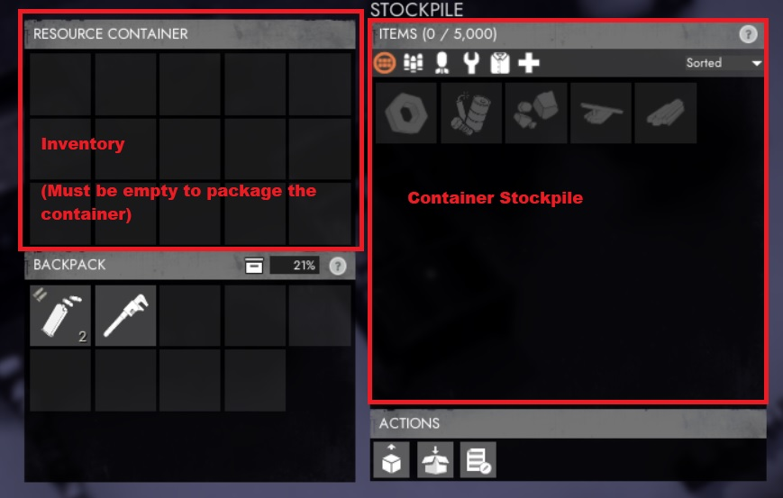
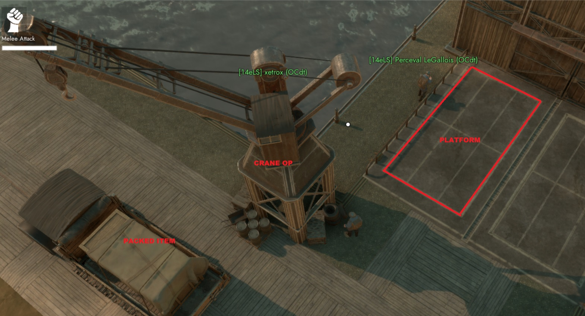
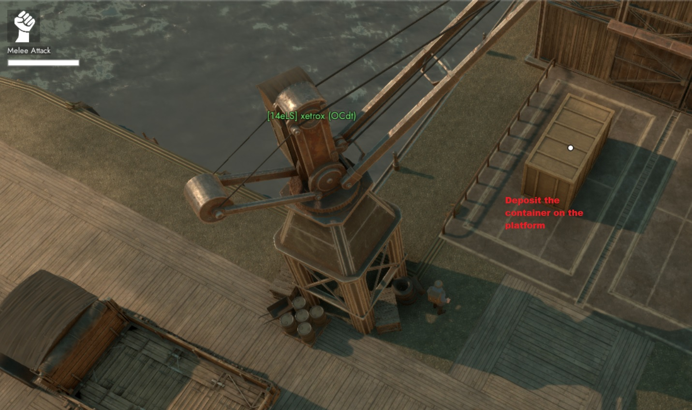
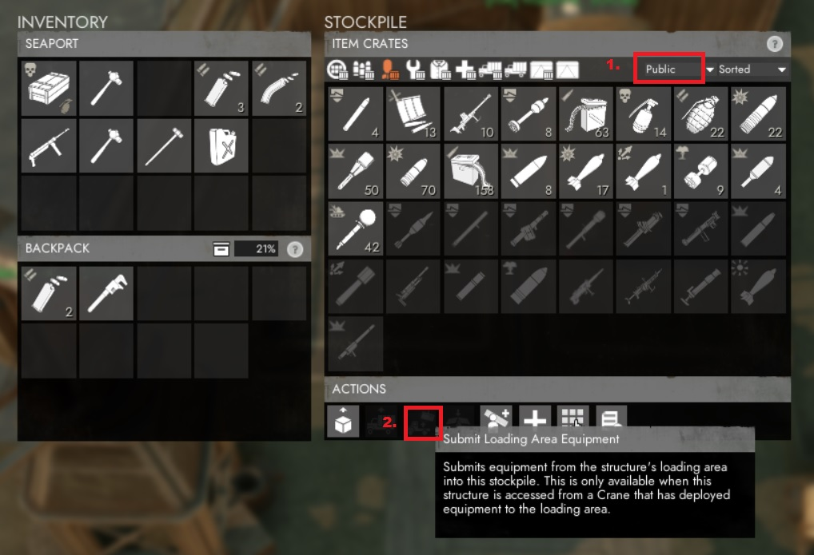
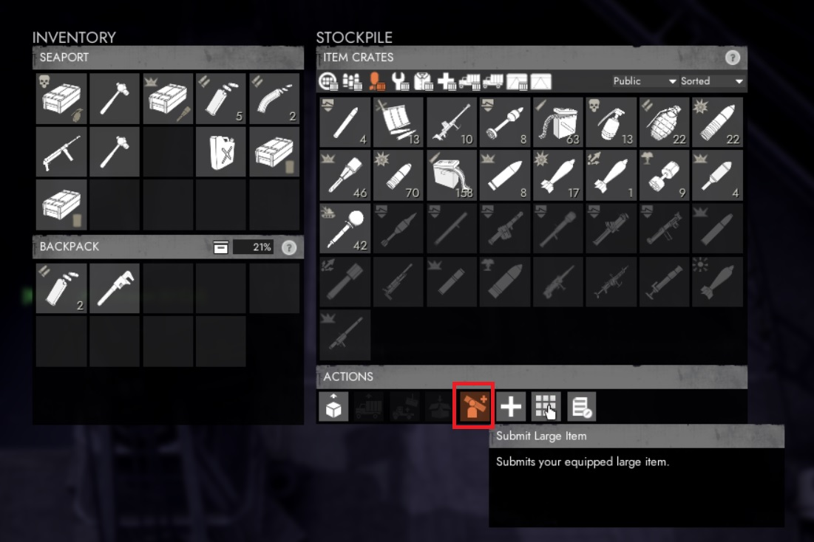

# LOGI 101

## INTRODUCTION

Some inspiring quotes about logistics and its vital importance.

> *"The line between disorder and order lies in logistics…"*
> - Sun Tzu

> *"Gentlemen, the officer who doesn't know his communications and supply as well as his tactics is totally useless."*
> - Gen. George S. Patton, USA

> *"Forget logistics, you lose."*
> - Lt. Gen. Fredrick Franks, USA, 7th Corps Commander, Desert Storm

> *"Leaders win through logistics. Vision, sure. Strategy, yes. But when you go to war, you need to have both toilet paper and bullets at the right place at the right time. In other words, you must win through superior logistics."*
> - Tom Peters - Rule #3: Leadership Is Confusing As Hell, Fast Company, March 2001

Lets dig in !

#### Definition :

In the FWG-logi regiment we considere that logistics covers :
- production of items
- 'Item' / 'vehicule' delievery
- Base building / base maintenance

This document will refere to :
- a crate : is a container of X number of a specific items. A crate takes 1 slot in an inventory
- item when the 'object' is not in a 'crate'

#### Job orders :

As a FWG logi-member, you will find your asignment in discord : #logi-orders
There will be pinned messages that describe what as to be :
- produced
- delievered
- where and when

## RESOURCES

they come in several types : **Salvage**, **Components**, **Crude Oil** & **Sulfur**

They are refined in the Refinery building as describe in the picture below.

| Raw			| Refined           				| Ratio  | Time per stack (min)
| ------------- |:-------------:					| -----:| -----:|
| Salvage		| Basic Material (*B-mat*)			| 2:1	| 0:06
| Salvage		| Diesel							| 10:1	| 0:12
| Salvage		| Explosive Materials (*E-mat*)		| 10:1	| 5:33
| Components	| Refined Materials (*R-mat*) 		| 20:1	| 0:40
| Crude Oil		| Petrol 							| 3:1	| 6:00
| Sulfur		| Heavy Explosive Material 			| 20:1	| 1:00

## PRODUCTION

The production of basic supplies such as : guns, ammo, solider shirts (used for respawn), tools etc... takes place in the **Factory** or **MPF** (**M**ass **P**roduction **F**actory)

#### Production of vehicules

To build vehicles, the player interacts with the building (by default pressing the E key). A vehicle build menu opens and the player can select which vehicle they want to build. A blueprint of the selected vehicle will spawn inside the Garage. You have 5 seconds to hammer it before it disapears (make sure you have ressource in your inventory)

**Only one vehicle blueprint can be created at a time.**
> in the first hours of the war, forget using it, the queue will be HUGE!
> instead RUSH the shipyard to get one from **public stockpile** or start scrapping by foot...

If you want to produce something in the rush => Factory.

If you're planning a production for - let's say - *tomorrow* use the **MPF** this will produce **crates** of 3 with a discout of 10% per crate!!
The only downside of MPF is its queue that can reach several hours... but **it's OK** especially if you produce **Expensive** ressources such as R-mat.

> **Learn to anticipate your needs!**

Early Game Advise :

> Start as soon as possible the production of trucks (Dunne Transport / Dunne Fuel in the MPF) => couple of hours after you will get 3x per crate!

## MOVING THINGS AROUND

#### Refuel Your Vehicule:

there are two ways to refuel a vehicule (manual / automated):
- You get a can and you do it by 'hand'. Equip the Diesel Fuel Can and click on the vehicule when your are next to it.
- You press the refuel action button when your are near a Fuel-truck. A connection will be establish between your vehicule and the Fuel Truck, refueling it automaticaly.

#### Early Game:

You won't have another choice other than using a **Dunne Transport** (cost : 100Bmat, produced in a Garage)

#### Once LoadLuggers are tech'ed:

They are used only to transport RAW materials (salvage / component etc...), use them when you go farming.
But then you will need a Dunne Transport to get your refined material (Bmat, Fuel etc...)

Advice:
> Grab some Petrol (not Diesel), take a LoadLugger and camp a component mine (feed the mine with petrol), you will get 6 component / sec instead of 2/sec with diesel

#### Late Game

Use a Harvester (120 R-mat)! Or a Sledgehammer if you're poor...

#### RESOURCE AND SHIPPING CONTAINERS

Resource/Shipping containers are produce on the **Construction Yard**,

They are used to carry a large quantities of items:
- *RESOURCE CONTAINER* for Raw Material, can contains up to 5,000 items,
- *SHIPPING CONTAINTER* for Refined Material (**CRATES** of items), can contained up to 40x crates,

To put things inside of it :
There are two 'places' where items are stored inside a container,
- its **'inventory'** : for temporary storage
- its **'Stockpile'** : where you store for *'long' term* and will be able to 'package' the container.
To put something inside the stockpile you have to **Submit it into** the stockpile.

In order to move / carry a container, it has to be 'packed'.
Once packed, they can be moved around with with a **Crane** or a **Flatbed**.

- How to pack:
1. Inventory **MUST be empty** : if not, submit the items to the container's stockpile by right clicking, then select **'submit'**
2. Pack it !

## STOCKPILE

Stockpiles are the main storage location in FOXHOLE.
You submit or retrieve items from stockpiles.
There are **PUBLIC** or **PRIVATE** stockpiles.
Private stockpile can be created at SEAPORT or STORAGE location.
Privates access private stockpiles using a code of several digits.
Those codes are given as 'Pinned' messages in discord : #logi-orders

Private Stockpiles have a lifespan of 2 days.
Everytime you PUT something inside of it, it will restart this timer.
Otherwise the content of the stockpiles goes into public.

We strongly advise you to use/create **PRIVATE** stockpile to avoid random players to take your precious production.
LOGI members of FWG will share their access code to the rest of the regiment so that we can share our ressources / items between us.

- How to create a **private** stockpile:

> name it : FWG
> share the access code in discord : #logi-orders with the location of the stockpile
> pin your post

- How to access a stockpile:

Enter the code to get access to a private stockpile

Then select the stockpile

- How to submit containers (3 steps)

A. Operate the crane to deposit the container on the plateform

B. Deposit the packed container on the plateform to submit it

C-1. Select the stockpile
C-2. Submit it

- How to submit a heavy items: (works for stockpile but also artilery piece / mortar etc...)

Same principle but click on: **"Submit large item"**

Send this to your captain / logi-manager to prouve you've read this document :

[101FWG-LOGI101]

## FAQ / how to :

- submit an item :

every item store in a **SEAPORT** stockpile must be in CRATE(s)
only vehicule can be store as 'vehicule' without to be 'crated'

**public** items stay public, they **can not** be store in private stockpile

- submit a vehicule

1. Select the stockpile where you want to submit your vehicule
2. submit it

- retrieve an item

1. check that nothing is on the plateform
2. click on the item of your choice

- Pack / unpack item (as crate)

You can create crate or retrieve your items from a crate by right-click on an item in your inventory

- Why use crate when moving stuff ?

If for some reason you get kill, or your vehicule is destroy, our enemy wont be able to use them without having to submit it to a stockpile
You don't want to ease those bastard collies partisant, right ?!

- Why should I NEVER use my personnal inventory when I carry a **valuable** items (such as prototypes)?!

It might happen from times to times that you get a **server connection timeout** in this case there is a highly probability that what you have on you will be LOST !!!
Thus, it is strongly recommend to store your valuable item into a locked-vehicule that will stays on the map,  because you will be able to get it back.
Otherwise it is lost forever...
I guess you don't want to lose a precious prototype, isn't ?

