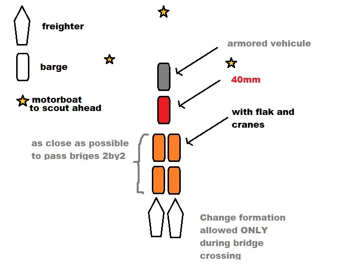
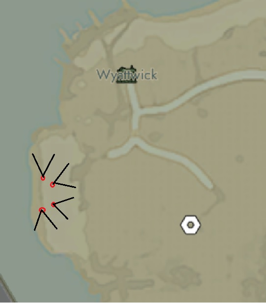
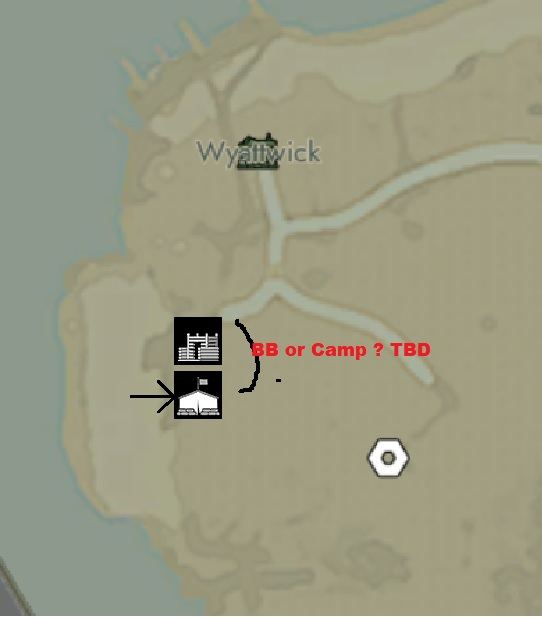
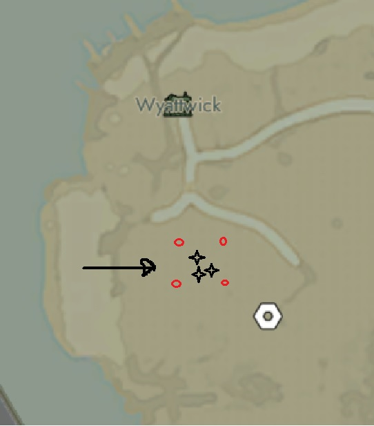

# [FWG] ARTILLERY OPERATION V0.0 [secure]

## OBJECTIVES

Trianing time for FWG navy seals !
The objective today will be to establish a front near a component field in Candle hills and most importantly HOLD-IT !

why there ?

1. Less compo for the collies obviously
2. There are hills overthere, if we can establish a camp near-by and hold-it, it will be a pain in the ass for them to take it back
> Obi-Wan: "It's Over Anakin! I have the high ground!"
3. This will be a training for all of us: landing, artillery, fast base building !

## EQUIPMENTS AND REQUIREMENTS

1. Available Equipments:

- 4 flak anti infantery
- 3x 120mm
- 1x 30mm
- 1x armor vehicule
- 2x barges loaded with standard QRF loadout
- 2x freighters : 6 trucks with (100Bmat, rest are 120mm shells) / 3x light art. piece + *to be prepared : shipping container (full of SS / ammo / bandages)*
- around ~200 others 120mm shells in Eidolo + 1 freighter
- 1x barges with a CV

2. Human ressources (exact Nbr tbd, but the more the better)

- Barges with crane will have to mens on board:

One that drives the barge (capt obvious) + one in the crane !
Get in the crane while its on a barge is hard and time consuming, we won't have this.

- Marines:

Hold a front further from artillery, their roles will be :

a. 1x to 2x scout(s) ahead (the scout does NOT engage !) he will just stay in a bush with its bino and transfert Intels

b. Rest of the marine corps will dig trenches / try to etablish a BB, while the artillery is getting in position

c. Marines does not fire until they find us, **DO NOT PUSH** or get **SPOTTED STUPIDLY** ! (it's a mid-stealth mission before everything goes BOOM BOOM)

> eqt:
> - stormrifles
> - 2x machine gun (Malone MK2)
> - 1x rpg
> - gaz / filters / radio
> - gaz grenages / HE

- Artilery operator:

3x per artilery piece (2x on the gun itself + 1 loader)
=> 3x pieces of artillery + 1 spotter = means MIN 10 men !

10 + 2 logi drivers once we will be able to move forward  = 12 mens !

## WORKFLOW

### PRE-OP / PARTISANT WORK

FWG will first land there, in the bushes (as it as been done these two passed days)

MAIN OBJECTIVES :

1. Blow up EVERY WATCH TOWER along the beach and road,
2. **Then** Target the compo field

### BOAT FORMATION

This is the boat formation we will have to respect at all time.
**The convoy must stay Hidden OTHERWISE this entire operation will be delayed or even canceled**

> Motorboat will have a very important role : SCOUTING !
> Fill free to ZigZag 100m to 200m in front and on the side of the convoy
> **IF Ennemies are detected, we will send BattleBarge to intercepts BEFORE they see the convoy**

### LANDING

Landing will go as follow:

1. armored vehicule:

He will scout ahead once 40mm and marines are deploy on the beach
First Objectives : Detect BB / WT / FoxHole, along the road and in-land until it reach the salvage field then REGROUP
**Again : DO NOT ENGAGE if you're spotted FALL BACK ! Stay alive !**

2. Cranes / Flak Cannon:

Crane will deposit the Flak according to this pattern:

Meanwhile 4 designated marines get the ammo (2 clips of 14.5mm) from the Barges that carry the Flak, unpacked the Flak and jump on it ASAP
Once cranes unload the flaks
They unload the artillery pieces as fast as possible:
All 3 cranes deployed nearby the 'artillery'-freighter

The forth crane deployed near the 'trucks'-freighter and unload the truck, + 1 Marines nearby to unpack the truck

While Freighter are unloaded:
- 5x Marines will dig foxhole around the area and secure it. **AGAIN ! DO NOT PUSH ANY FURTHER**
- cv go straight EAST with marines to establish a respwn point:

3. Once position is secured (tbd= BB built / Base encampment):

Crane will move the artillery piece further East as the picture below (**black-stars**):

Once art. pieces are deposit:
- marines ON FLACK :  **UNLOAD THE FLACK** THEN packed the Flak
> Dont be to close to the flak, you wont be able to packed it
> IF flake take DMG, the truck with shells have 100Bmat each to fix them

- 2x artillery operators will create buffer-boxes for the shells (100x Bmat available in each shells-trucks)

- cranes go back on beach
- move the flak again according to image above (**red dot**)

4. Once freighter is unloaded:

- head back to Eidolo and bring supplies (SS / AMMO / Gaz mask / more 120mm shells PREVIOUSLY LOADED IN TRUCK **not in CRATES** !)
- barges head back to sanctuary to bring more men / randoms and does that back and force without stopping

5. LOGI :

**DO NOT STOP** until it is over !
- ressupply with SS / BMAT / GAZ MASK / FILTER / 7.92mm (stormrifles) / HE / Gaz gre / radio /

